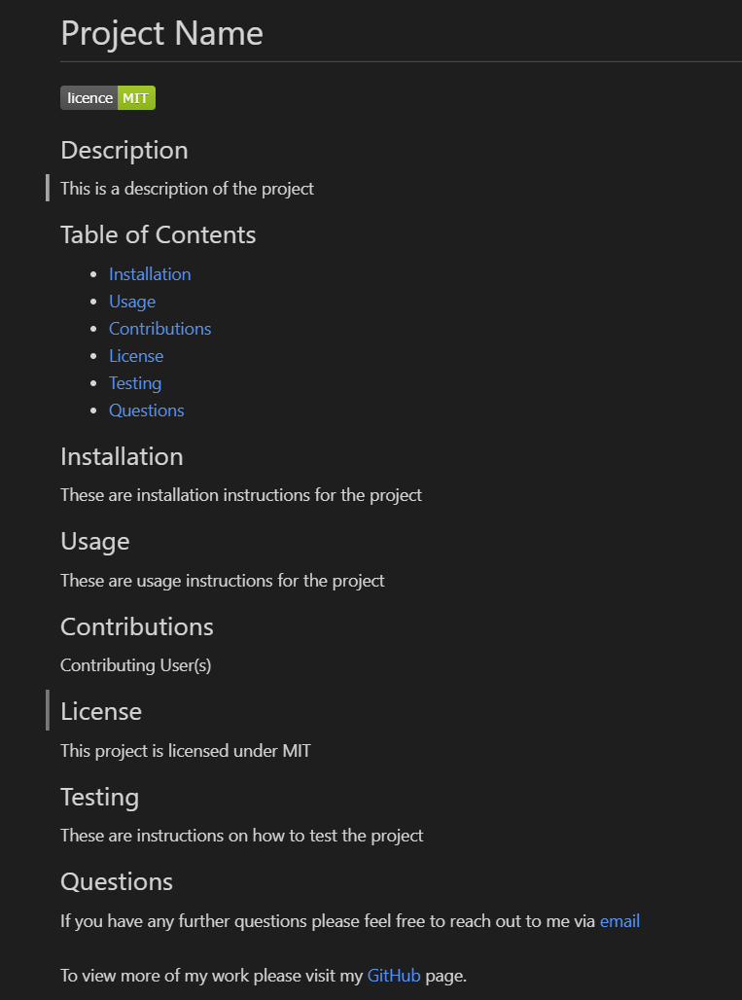

# Professional README Generator

## Description
This was a class assignment in which I was tasked to create an app that users can generate a professional readme from the command line.

## Installation
To install this project simply clone the repository onto your machine.

## Usage
To use open in terminal at the root level and input the command "npm index.js". Next answer all the questions provided. After answering all questions a markdown file will be generated in the "dist" directory titled "README.md" with information based on user input.

## Example
The image below shows an example of what will be generated after a user inputs their responses.
 
Below the image is a link to a video demonstration of how to use the application.

https://drive.google.com/file/d/19eV2YCpXUMT5C7znwiKRdcUfSNDrn5GB/view